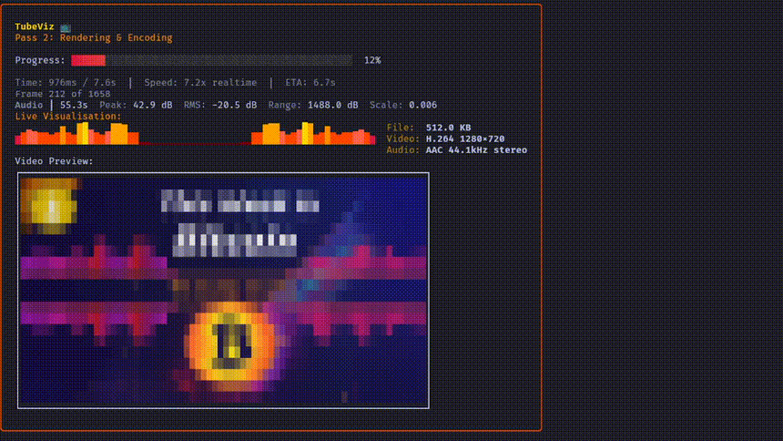

# TubeViz 🎬

> Transform your podcast audio into stunning YouTube visualizations with Synthwave-themed frequency bars and advanced algorithms.

Forked from [Jivefire](https://github.com/linuxmatters/jivefire) with enhanced visualization algorithms inspired by [vibeviz](https://github.com/noblepayne/vibeviz).

## Quick Start (Nix)

```bash
nix run github:ChrisLAS/TubeViz#tubeviz -- input.wav output.mp4 --theme synthwave
```

### Install with Nix

```bash
nix profile install github:ChrisLAS/TubeViz#tubeviz
```

## Overview

TubeViz turns plain audio into motion. Feed it WAV, MP3, or FLAC and get 720p visuals that react to every word, laugh, and frequency.

<div align="center"></div>

### Fancy Features

- 🎬 **Two-pass streaming pipeline** for accurate scaling with low memory use
- 🌈 **Synthwave theme** with purple→pink→cyan gradient bars
- 🎚️ **64 discrete bars** with logarithmic 40Hz–18kHz binning
- 🏃 **Velocity-based decay** that prevents spikes and keeps motion natural
- 🖼️ **Thumbnail generator** for YouTube-style episode art
- ⚡ **Parallel RGB→YUV conversion** with auto-detected GPU acceleration
- 📦 **Single static binary** with bundled FFmpeg (Linux amd64/aarch64, macOS Intel/Apple Silicon)

## Usage

### Generate Video (Default Theme)
```bash
./tubeviz input.wav output.mp4 --theme default
```

### Generate Video (Synthwave Theme)
```bash
./tubeviz input.wav output.mp4 --theme synthwave
```

### With Episode Number and Title
```bash
./tubeviz --episode=42 --title="This Week in Bitcoin" input.wav output.mp4 --theme synthwave
```

## Build

TubeViz uses [ffmpeg-statigo](https://github.com/linuxmatters/ffmpeg-statigo) for FFmpeg static bindings.

```bash
# Setup or update ffmpeg-statigo submodule and library
just setup

# Build and test
just build        # Build binary
just test         # Run tests
just test-encoder # Test encoder
```

## Why TubeViz?

FFmpeg’s built-in visualization filters (`showfreqs`, `showspectrum`) produce continuous spectra, not discrete bars. That’s a non-starter. You can stack filters all day — you’ll never get a clean, intentional 64-bar look out of FFmpeg alone.

So Jivefire's big brain move was: flip the model, do the FFT analysis and bar rendering ourselves, then hand-finished frames to FFmpeg purely for encoding. A great idea, and we are going to build off it.

**Why Go instead of Python?**  

Podcast production demands headless, multi-architecture tools that run in pipelines; not a frozen desktop app.

The TubeViz architecture is documented in [ARCHITECTURE.md](docs/ARCHITECTURE.md).

## Attribution

TubeViz is based on [Jivefire](https://github.com/linuxmatters/jivefire) by Linux Matters, with visualization algorithm improvements inspired by [vibeviz](https://github.com/noblepayne/vibeviz). Licensed under GPL v3.
